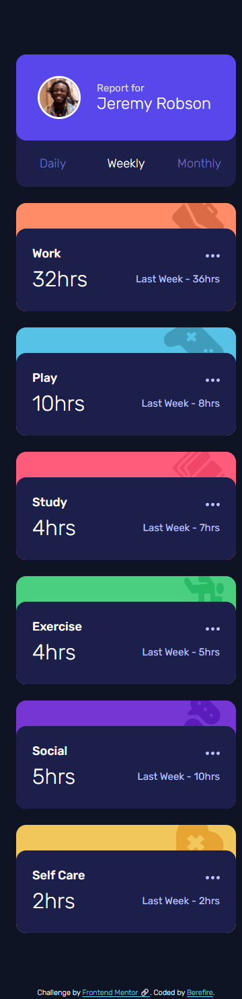
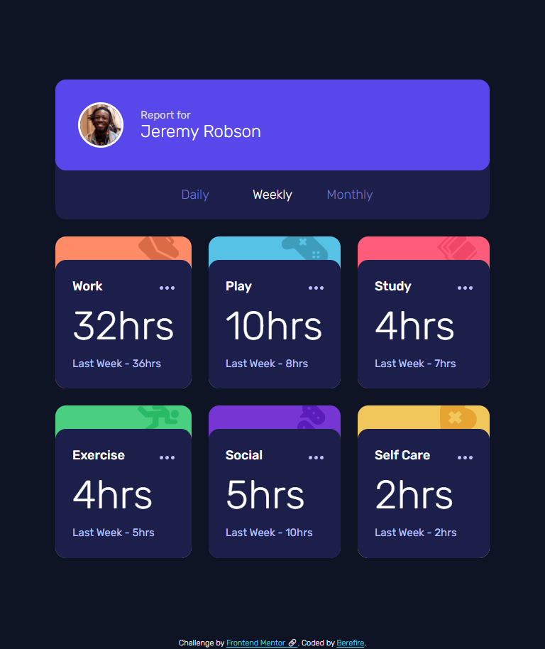
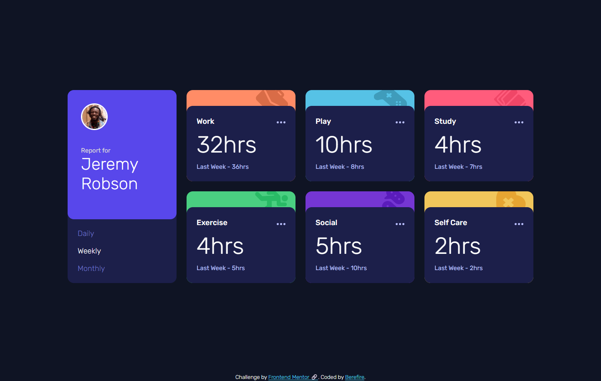
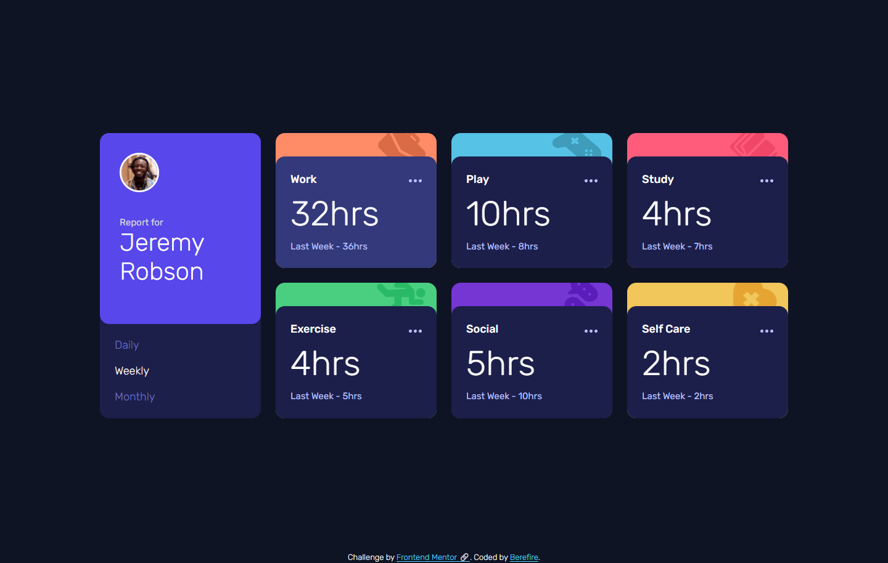

# Frontend Mentor - Time tracking dashboard solution


[](https://www.frontendmentor.io/)
[](https://vitejs.dev)


This is a solution to the [Time tracking dashboard challenge on Frontend Mentor](https://www.frontendmentor.io/challenges/time-tracking-dashboard-UIQ7167Jw). Frontend Mentor challenges help you improve your coding skills by building realistic projects.

## Table of contents

- [Overview](#-overview)
  - [The challenge](#the-challenge)
  - [Screenshot](#-screenshot)
  - [Links](#links)
- [My process](#️-my-process)
  - [Built with](#-built-with)
  - [What I learned](#-what-i-learned)
  - [Continued development](#-continued-development)
  - [Useful resources](#-useful-resources)
  - [AI Collaboration](#-ai-collaboration)
- [Author](#-author)
- [Acknowledgments](#-acknowledgments)

---

## 📋 Overview

This project is a time tracking dashboard that dynamically displays activity data based on selected timeframes (daily, weekly, monthly).

The main focus of this implementation was:

- Modular JavaScript architecture
- Clean separation of concerns
- Accessibility improvements
- Scalable CSS architecture using CUBE CSS
- Data-driven UI rendering

---

### The challenge

Users should be able to:

- View the optimal layout for the site depending on their device's screen size
- See hover states for all interactive elements on the page
- Switch between viewing Daily, Weekly, and Monthly stats

---

### 📸 Screenshot

| _Mobile (375x914)_ | _Tablet (768x914)_ | _Desktop (1440x914)_ |
| ------------------ | ------------------ | -------------------- |
|  |  |  |

| _Active States_ |
| --------------- |
|   |

---

### Links

- Solution URL: [Add solution URL here](https://your-solution-url.com)
- Live Site URL: [https://berefire.github.io/time-tracking-dashboard/](https://berefire.github.io/time-tracking-dashboard/)

---

## ⚙️ My Process

### 🛠 Built With

- Semantic HTML5 markup
- CSS custom properties (Design Tokens)
- **CUBE CSS architecture**
- Mobile-first workflow
- **Vanilla JavaScript (ES Modules)**
- **Vite** for development and build tooling
- Accessible UI patterns (ARIA attributes, state sync)

---

### 🧠 What I learned

#### Modular JavaScript architecture

The application was structured using a feature-based modular approach:

- `state` → single source of truth
- `service` → data fetching
- `view` → DOM rendering
- `controller` → orchestration
- `events` → event handling
- `mapper` → data adaptation layer

This improved scalability and maintainability.

#### Data transformation layer (Mapper)

Since the API data did not include unique identifiers, I implemented a **mapping layer** to connect data with DOM elements:

```js
const ACTIVITY_MAP = {
  Work: 'work',
  Play: 'play',
  'Self Care': 'self-care'
};
```

This decouples the UI from the data structure and avoids fragile string manipulation.

#### DOM optimization

Instead of querying the DOM repeatedly, I cached elements:

```js
const elements = Object.fromEntries(...);
```

This improved performance and simplified rendering logic.

#### Accessibility improvements

- `aria-pressed` for toggle buttons
- `aria-live` for dynamic content updates
- semantic HTML structure
- keyboard-friendly interactions

#### Responsive design with tokens

Responsive behavior was handled through design tokens:

- primitive tokens (sizes, spacing)
- semantic tokens (component behavior)
- responsive overrides in tokens instead of components

---

### 🚀 Continued development

In future iterations, I would like to improve:

- State management patterns (closer to reactive systems)
- Fine-grained DOM updates (partial rendering)
- Advanced accessibility testing with screen readers
- Performance optimization for larger datasets

---

### 📖 Useful resources

- [MDN Web Docs](https://developer.mozilla.org/es/) - excellent reference for HTML, CSS, and JavaScript
- [WebAIM](https://webaim.org/) - accessibility guidelines and contrast checking
- [Frontend Mentor](https://www.frontendmentor.io) - real-world frontend challenges and design files

---

### 🤖 AI Collaboration

AI tools were used as development assistants during this project.

#### Tools used

- ChatGPT – debugging, architecture improvements, accessibility guidance

#### How AI was used

AI was primarily used to:

- Review and improve JavaScript architecture (modular design, separation of concerns)
- Suggest accessibility improvements (ARIA attributes, state synchronization)
- Assist in optimizing CSS architecture (tokens, CUBE CSS structure)
- Help design a data transformation layer (mapper) to decouple UI from data
- Support debugging and problem-solving during development
- Assist in writing and refining project documentation

#### What worked well

AI was particularly useful for:

- Identifying architectural improvements such as separating state, view, and controller logic
- Suggesting the use of a mapper layer instead of fragile string normalization
- Improving accessibility by recommending `aria-live`, `aria-pressed`, and better state synchronization
- Helping reduce DOM queries by introducing element caching strategies
- Providing clear explanations that helped reinforce understanding of frontend patterns

#### What didn't work as expected

Some suggestions required manual adjustments or validation:

- Certain recommendations assumed control over the data structure (e.g., adding `id` to JSON), which was not possible in this project
- Some architectural suggestions needed adaptation to fit the existing project scope and constraints
- Not all performance optimizations were necessary for this project size and required judgment to avoid overengineering

All AI-generated suggestions were reviewed, adapted, and implemented thoughtfully to ensure the final code remains clean, maintainable, and fully understood.

---

## 👤 Author

- Frontend Mentor - [@berefire](https://www.frontendmentor.io/profile/berefire)
- GitHub - [@berefire](https://github.com/berefire)

---

## 🙏 Acknowledgments

Thanks to Frontend Mentor for providing practical challenges that help developers improve real-world frontend skills.

---
